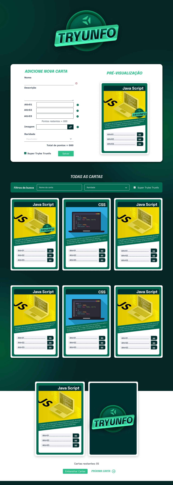

## TRYUNFO - JOGO DE CARTAS



Esse projeto é um jogo de cartas no estilo Super Trunfo!

<a href="https://www.figma.com/file/BZbftXbClcRkNHG4thIVS8/%5BProjeto%5D%5BFrontend%5D-Tryunfo?type=design&node-id=2-2&mode=design&t=uoT1nMv4aefjVhqw-0">

</a>

## 🛠️ Stack

Este projeto foi desenvolvido com as seguintes tecnologias:

- React
- React Form
- Controle de estado
- localStorage

## ⚙️ O que o app faz?

- Criar um baralho com o tema livre;
- Adicionar e remover uma carta do baralho;
- Visualizar todas as cartas que foram adicionadas ao baralho;
  -Jogar com o baralho criado.

## [](https://github.com/JessicaLopesDev/tryunfo) 🚀 Como executar o projeto

#### 🧭 Rodando a aplicação

```bash

# Clone o repositório

$ git clone https://github.com/JessicaLopesDev/tryunfo.git

# Acesse a pasta do projeto

$ cd tryunfo

# Instale as dependências

$ npm install

# Execute a aplicação

$ ynpm start

```
